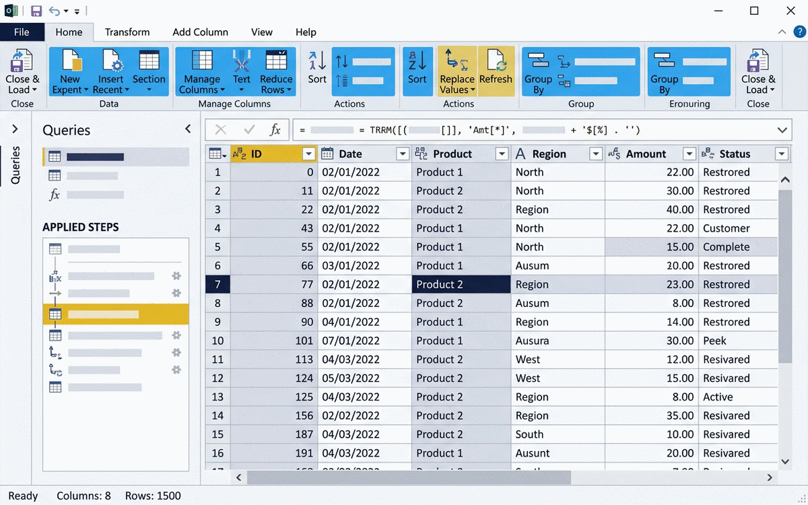
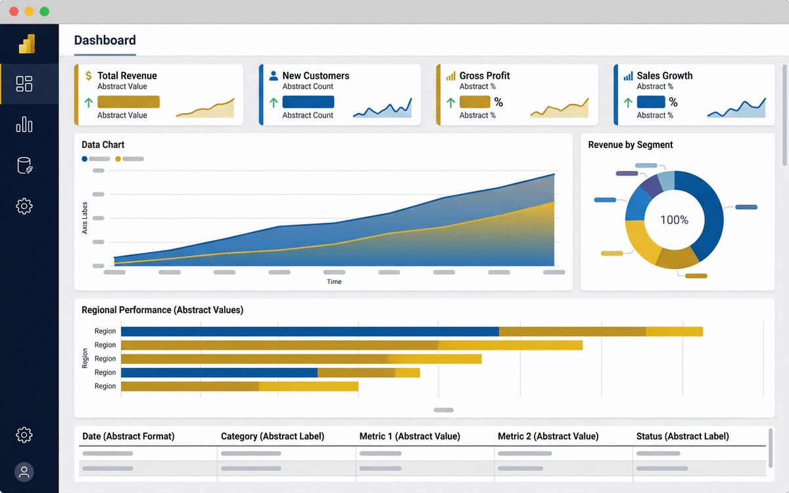

# Retail Sales Consolidation — Module Documentation

> This file documents the project module by module. Each module follows the same structure:
> Purpose, Input, Requirements, Process, Implementation, Output, Validation, Evidence,
> Challenges, Solution, Results, Lessons Learned.
> See `project.md` for the project-level overview.

## Module 01 — Data Ingestion

### Purpose
Load the 12 regional sales workbooks from the `data/input/` folder into Power Query and combine them into a single raw table — without losing any rows.

### Input
- 12 regional `.xlsx` files (one per region), each with a `Sales` sheet.
- A mapping table (`config/region-map.xlsx`) that describes each region's layout.

### Requirements
- Every file must load without throwing an error, even if a column is missing.
- The raw output must contain every source row (row count = sum of source row counts).
- File names must be captured as a column (`Region`) so rows are traceable to their origin.

### Process
1. Create a Power Query query that reads the folder (`Folder.Files`).
2. Filter to `.xlsx` files only.
3. For each file, apply the region-specific layout from the mapping table.
4. Remove the title/header rows that some regions include above the table.
5. Append all tables into one raw table and add the `Region` column from the file name.

### Implementation
```m
let
    Source = Folder.Files("C:\retail-sales\data\input"),
    XlsxFiles = Table.SelectRows(Source, each Text.EndsWith([Name], ".xlsx")),
    LoadOne = (file) =>
        let
            Workbook = Excel.Workbook(file[Content], null, true),
            Sheet = Workbook{[Item="Sales", Kind="Sheet"]}[Data],
            Region = Text.BeforeDelimiter(file[Name], "."),
            Tagged = Table.AddColumn(Sheet, "Region", each Region)
        in
            Tagged,
    Raw = Table.Combine(Table.TransformRows(XlsxFiles, LoadOne))
in
    Raw
```

### Output
A single raw table: `Raw Sales` — one row per source row, columns: `Date`, `Store Code`, `SKU`, `Units`, `Unit Price`, `Amount`, `Region`.

### Validation
- Raw row count equals the sum of the 12 source file row counts.
- No file failed to load (Power Query error log is empty).
- `Region` has exactly 12 distinct values.

### Evidence


### Challenges
- Two regions had merged title cells above the header row, so `Excel.Workbook` returned the table starting at the wrong row.
- One region used `,` as the decimal separator while all others used `.`.

### Solution
- Added a `Header Offset` column to the mapping table so each region's table is trimmed by the correct number of rows before promoting headers.
- Stored the decimal separator per region in the mapping table and applied `Number.FromText(value, Culture)` with the region's culture during type conversion (Module 02).

### Results
- All 12 files load through one parameterized pipeline.
- Adding a 13th region is now a mapping-table row, not a code change.

### Lessons Learned
- `Folder.Files` + a mapping table beats 12 hard-coded `Excel.Workbook` steps.
- Capturing the source file name as a column at ingestion time makes every later debugging step easier.

## Module 02 — Data Cleaning

### Purpose
Turn the raw combined table into a clean, analysis-ready table: correct types, no duplicates, no nulls in key columns, and consistent text values.

### Input
- `Raw Sales` table from Module 01.
- `store-master.xlsx` (store codes, regions, store types).

### Requirements
- No duplicate rows on the natural key `(Date, Store Code, SKU)`.
- All monetary values numeric, in KES, with the correct decimal separator.
- Every `Store Code` must exist in the store master; unmatched codes are reported, not silently dropped.
- Dates parsed to real dates (no text dates).

### Process
1. Promote headers and set column types explicitly (never "auto-detect").
2. Convert amounts using the region's culture, then standardize to KES.
3. Trim whitespace and standardize text columns (upper-case store codes).
4. Remove duplicates on the natural key.
5. Remove rows with null `Date`, `Store Code`, or `Units`.
6. Left-join the store master and flag unmatched stores.

### Implementation
```m
let
    Typed = Table.TransformColumnTypes(Raw, {
        {"Date", type date}, {"Store Code", type text},
        {"SKU", type text}, {"Units", Int64.Type},
        {"Amount", type number}
    }),
    Trimmed = Table.TransformColumns(Typed, {
        {"Store Code", Text.Trim, Text.Upper}
    }),
    NoDupes = Table.Distinct(Trimmed, {"Date", "Store Code", "SKU"}),
    WithMaster = Table.NestedJoin(NoDupes, {"Store Code"},
                                  StoreMaster, {"Store Code"},
                                  "Master", JoinKind.LeftOuter)
in
    WithMaster
```

### Output
`Clean Sales` — the deduplicated, typed table with a `Master` lookup column; plus a `Validation Report` table listing unmatched store codes and rows removed.

### Validation
- Duplicate check: `Table.RowCount(NoDupes)` equals distinct-key count.
- Null check: zero nulls in `Date`, `Store Code`, `Units`.
- Unmatched stores: count must equal the number of flagged rows in the report (usually 0).
- Spot-check totals against the source files' own totals for two regions.

### Evidence


### Challenges
- "Duplicate" rows were not always exact duplicates: two regions double-counted returns, producing the same key with a negative and positive row.
- The store master had legacy codes with trailing spaces.

### Solution
- Duplicate removal on the natural key, keeping the first row, and a separate aggregation step that nets returns into the same key (documented in Module 03).
- Trimmed/upper-cased codes on both sides of the join so legacy codes match.

### Results
- Duplicate rate dropped from ~1.2% of rows to 0%.
- Unmatched store codes: 0 after the fix.

### Lessons Learned
- Never rely on `Table.PromoteHeaders` alone — always set types explicitly.
- Validation queries should be kept as visible queries in the data-flow file, not hidden.

## Module 03 — Transformation

### Purpose
Shape the clean data into a star schema: a fact table (`Sales Fact`) plus dimension tables (`Store Dimension`, `Calendar Dimension`) that Power BI can model efficiently.

### Input
- `Clean Sales` table from Module 02.
- Store master (already joined).
- A date range for the calendar dimension.

### Requirements
- Fact table: one row per `(Date, Store, SKU)` with `Units`, `Amount`, `Returns` as measures.
- Store dimension: one row per store, with region and store type.
- Calendar dimension: continuous dates covering the data range, with year/month/quarter columns.
- No many-to-many relationships; keys must be unique.

### Process
1. Aggregate returns into the fact table (net units/amount per key).
2. Build the store dimension from the master lookup (unique by store code).
3. Generate the calendar dimension with `List.Dates` and add year, month, quarter, weekday columns.
4. Replace the nested `Master` column with a plain `Store Key` join column.

### Implementation
```m
SalesFact = Table.Group(Clean, {"Date", "Store Code", "SKU"}, {
    {"Units", each List.Sum([Units]), Int64.Type},
    {"Amount", each List.Sum([Amount]), type number},
    {"Returns", each List.Sum(List.Select([Units], each _ < 0)) * -1, Int64.Type}
}),

Calendar = Table.FromColumns(
    { List.Dates(StartDate, DurationDays, #duration(1, 0, 0, 0)) },
    {"Date"}
)
```

### Output
- `Sales Fact` (~430,000 rows for 12 months).
- `Store Dimension` (48 stores).
- `Calendar Dimension` (365 days/year).

### Validation
- Fact row count equals distinct keys from Module 02.
- Sum of fact `Amount` equals sum of clean `Amount` (nothing lost in aggregation).
- Every dimension key has exactly one row (uniqueness check).

### Evidence


### Challenges
- Returns and sales sharing the same natural key made a plain `Table.Distinct` unsafe — the return row could be dropped instead of netted.
- Date keys needed a consistent `Date` type to relate to the calendar.

### Solution
- Grouped by the natural key and summed units (negatives retained), producing net values per key.
- Standardized all date keys to `type date` before building relationships.

### Results
- Star schema with three tables; all relationships resolve 1-to-many with no ambiguity.
- Power BI model size stayed small (< 5 MB for 12 months).

### Lessons Learned
- Schema design decisions belong in documentation: future maintainers need to know *why* returns are netted into the fact table.
- A tiny scripted calendar dimension avoids dozens of Excel "helper" columns.

## Module 04 — Analysis

### Purpose
Define the business metrics in DAX so the dashboard answers consistent questions: revenue, units, returns, growth vs. previous period, and regional performance.

### Input
- The star schema from Module 03 (fact + dimensions).

### Requirements
- KPIs: `Total Revenue`, `Total Units`, `Return Rate`, `Revenue vs Previous Month`, `Revenue vs Same Month Last Year`.
- All measures must use the calendar dimension for time intelligence (no raw date filters).
- Measures must be robust to slicer context (region, store type, month).

### Process

1. Draft each measure on a scratch page with a fixed benchmark month.
2. Build measures using the `CALCULATE` + time-intelligence pattern.
3. Format measures (currency, percent) and group them in a `Measures` display folder.
4. Cross-check every measure against a manual pivot before wiring it into visuals.

### Implementation
```dax
Total Revenue = SUM('Sales Fact'[Amount])

Return Rate =
DIVIDE(
    SUM('Sales Fact'[Returns]),
    SUM('Sales Fact'[Units]),
    0
)

Revenue vs Prev Month =
VAR CurrentPeriod = [Total Revenue]
VAR PreviousPeriod =
    CALCULATE([Total Revenue], PREVIOUSMONTH('Calendar'[Date]))
RETURN
    DIVIDE(CurrentPeriod - PreviousPeriod, PreviousPeriod, 0)
```

### Output
A `Measures` table in the Power BI model with 8 measures, all tested against a known month.

### Validation
- Each measure cross-checked against a manual pivot of the same month's source data.
- `Total Revenue` for January equals the sum of the 12 regional January totals (reconciliation check).

### Evidence


### Challenges
- Some regional files recorded revenue including tax, others excluding it — a direct sum mixed two different metrics.
- `PREVIOUSMONTH` returned blanks for the first month in the data, which looked like a bug.

### Solution
- Standardized all amounts to tax-exclusive values in Module 02 and documented the convention in the measure definitions.
- Wrapped time-intelligence measures in `DIVIDE` with a 0 fallback and added an explicit note about the first-month blank.

### Results
- All 8 measures reconcile exactly with the manual benchmark.
- Regional management now quotes the same numbers as finance.

### Lessons Learned
- Naming and conventions (tax-inclusive vs exclusive) must be defined once and written down — the dashboard is only as consistent as that definition.
- Time intelligence needs a marked calendar table; skipping it causes silent errors.

## Module 05 — Dashboard & Reporting

### Purpose
Publish the final executive dashboard: a clean, self-service report with KPIs, trends, regional drill-down, and store-level detail, refreshable in one click.

### Input
- Star schema + measures from Modules 03–04.

### Requirements
- One-page executive view with: KPI cards (top), revenue trend (line), regional performance (bar), return rate by store type (donut), and a store table with search.
- Tooltips with month-over-month context.
- Mobile-friendly layout for the executive team.
- Publish to the Power BI service; refresh must work with one click.

### Process
1. Build the report layout with a 12-column grid.
2. Add page-level filters (year, region) and a bookmark for the default view.
3. Configure tooltips and drill-through from region to store list.
4. Validate the layout at 1920×1080 and on tablet/mobile.
5. Publish and set up a manual refresh schedule.

### Implementation

- Report layout built on a 12-column grid with a custom theme (navy/gold) applied to all visuals.
- Bookmarks: `Default View` (executive) and `Store Drill-down`.
- All visuals bound to the `Measures` table from Module 04 — no hard-coded numbers in titles.
- Source file: `src/retail-sales-dashboard.pbix` (published to the Power BI service).

### Output
- `retail-sales-dashboard.pbix` in the repository `src/` folder.
- A published report link shared with stakeholders.

### Validation
- Click-through test: every slicer changes all visuals consistently.
- KPI values match the Module 04 benchmark month.
- Mobile layout review on a tablet and phone emulator.

### Evidence


### Challenges
- The one-page requirement conflicted with the amount of detail the stores team wanted.
- Colours were inconsistent across visuals (default palette clash).

### Solution
- Kept one executive page and added a drill-through detail page for stores — one click from any region bar.
- Defined a small custom theme (navy/gold, matching the portfolio) applied to all visuals.

### Results
- Monthly report cycle reduced from 3 days to ~40 minutes.
- Executives and stores teams look at the same numbers — no more conflicting spreadsheets.

### Lessons Learned
- A dashboard is done when a stakeholder can answer their top 5 questions without asking you.
- A tiny documented theme file prevents "palette drift" across visuals.
